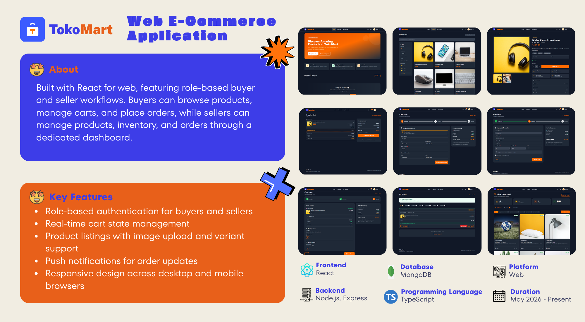
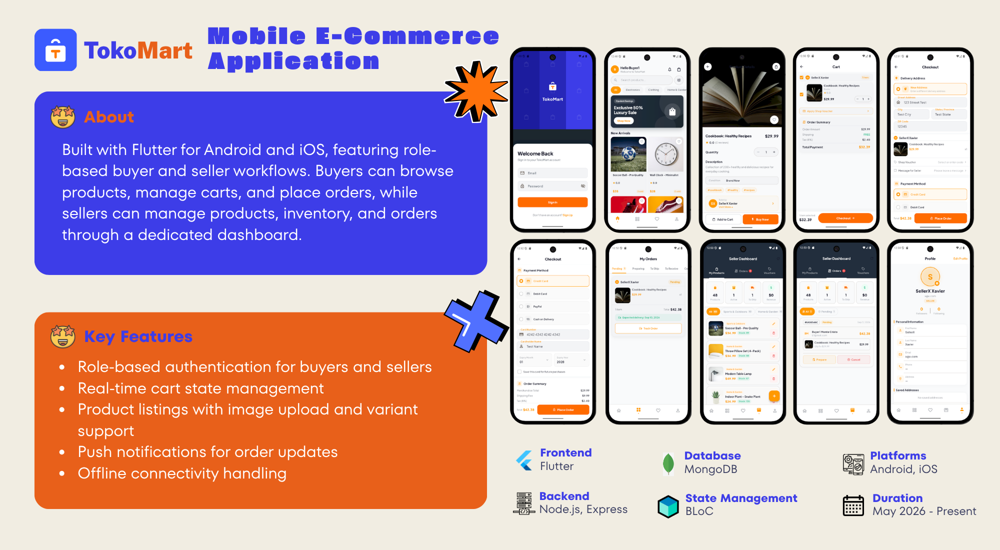

<div align="center">

# TokoMart - Full-Stack E-Commerce Application

A full-featured multi-seller e-commerce application with a React web frontend, Flutter mobile app, and Node.js/MongoDB backend, built with TypeScript, Tailwind CSS, Express, and Dart.

  
  

</div>

---

## 📋 Status

- ✅ **Core Features**: Complete
- ✅ **Stripe Payment Integration**: Complete (web + mobile)
- ✅ **Saved Payment Methods**: Complete (web + mobile)
- ✅ **Web Payment Processing**: Fixed (PR #73)
- ✅ **Mobile Code Quality**: Refactored
- ⏳ **Chat with Auto-Reply**: Planned
- ⏳ **Real-time Notifications**: In progress

---

## ✨ Features

### Shopping & Cart
- **Product Browsing**: Search, filter by category/price/rating across all sellers
- **Multi-Seller Support**: Products grouped by seller with independent shipping & tax
- **Shopping Cart**: Add/remove items, persistent across sessions (MongoDB-backed)
- **Per-Seller Checkout**: Each seller's subtotal, shipping, and tax calculated separately
- **Wishlist**: Save products to favorites with unread badge

### Payment & Checkout
- **Payment Methods**:
  - ✅ **Credit/Debit Cards** (via Stripe)
  - ✅ **Cash on Delivery** (COD)
  - ✅ **Saved Payment Cards** (web + mobile)
  - ✅ **Auto-select Default Card** (mobile)
  - ✅ **Manage Cards** (view, delete, set default in profile)
- **Checkout Flow**: Multi-step (shipping → payment → review) with saved addresses
- **Shipping Options**: Standard, Express, Pickup — per-seller configured

### Orders & Reviews
- **Order Management**: Track status (Pending → Preparing → Shipped → Delivered)
- **Order History**: View past orders with per-item details
- **Product Reviews**: Star rating + written review after delivery
- **Cancellation**: Buyer/seller can cancel through `processing` status

### Seller Features
- **Multi-Step Product Wizard**: 7-step form (Basic Info → Pricing → Description → Variants → Images → Shipping → Review)
- **Product Management**: Create, edit, delete with real-time pricing breakdown
- **Inventory Tracking**: Stock management with automatic restoration on cancellation
- **Order Management**: Update status, track shipments
- **Seller Dashboard**: Order inbox with new order notifications (polled every 30s)

### Users & Accounts
- **Authentication**: JWT-based signup/login with bcrypt password hashing
- **User Profiles**: Edit personal info, upload avatar, manage addresses & payment methods
- **Role-Based Navigation**: Buyer vs Seller — navigation adapts per role
- **Dark Mode**: System preference-aware with manual toggle

### Technical
- **Offline Support**: Yellow banner when network lost; graceful error handling
- **Cart Persistence**: Synced to MongoDB (600ms debounce) and restored on login
- **Cross-Account Isolation**: Cart cleared on logout; each user sees only their cart
- **Responsive Design**: Mobile-first layout working on all screen sizes
- **Error Handling**: User-friendly messages with retry hints for network failures

---

## 🏗️ Tech Stack

### Web Frontend (`frontend/`)
| Layer | Technology |
|---|---|
| Framework | React 18 + TypeScript 5 |
| Build | Vite 5 |
| Styling | Tailwind CSS 3 |
| Routing | React Router v6 |
| State | React Context API |
| Payment | Stripe.js + @stripe/react-stripe-js |
| Icons | Lucide React |

### Mobile App (`frontend-mobile/`)
| Layer | Technology |
|---|---|
| Framework | Flutter 3 + Dart 3 |
| State | BLoC / Cubit + flutter_bloc |
| Navigation | GoRouter |
| HTTP | Dio |
| Payment | flutter_stripe |
| E2E Tests | Patrol |
| Connectivity | connectivity_plus |

### Backend (`backend/`)
| Layer | Technology |
|---|---|
| Runtime | Node.js 18+ + TypeScript 5 |
| Framework | Express.js 4 |
| Database | MongoDB + Mongoose |
| Authentication | JWT + bcryptjs |
| Payment | Stripe API |
| File Upload | Multer |
| Security | Helmet, CORS, rate-limiting |

---

## 📁 Project Structure

```
shopping-app-automation/
├── frontend/                       # React web app
│   ├── src/
│   │   ├── components/
│   │   │   ├── common/             # Button, Card, Input, Badge, Spinner
│   │   │   ├── layout/             # Navbar, Footer, Layout
│   │   │   └── payment/            # CardElement, PaymentForm
│   │   ├── pages/
│   │   │   ├── auth/               # Login, Signup
│   │   │   ├── shopping/           # Home, Products, ProductDetail, Cart
│   │   │   ├── checkout/           # Checkout (3-step wizard)
│   │   │   ├── orders/             # OrderHistory, OrderDetail
│   │   │   ├── profile/            # Profile, PaymentMethods, Addresses
│   │   │   └── seller/             # SellerDashboard, ProductWizard
│   │   ├── context/                # Auth, Cart, Theme
│   │   ├── hooks/                  # useOnlineStatus, useCart, useAuth
│   │   ├── services/               # API clients (auth, cart, order, product, payment)
│   │   ├── types/                  # TypeScript interfaces
│   │   ├── utils/                  # formatters, validators, constants
│   │   └── config/                 # API endpoints, Stripe config
│   └── package.json
│
├── frontend-mobile/                # Flutter mobile app
│   ├── lib/
│   │   ├── core/
│   │   │   ├── constants/          # AppStrings, AppColors, AppSizes
│   │   │   ├── models/             # SavedPaymentMethod, etc
│   │   │   ├── network/            # ConnectivityCubit, DioClient
│   │   │   ├── services/           # StripeService, PaymentService
│   │   │   ├── theme/              # ThemeData, colors
│   │   │   └── widgets/            # OfflineBanner, CommonWidgets
│   │   └── features/
│   │       ├── auth/               # Login, Signup + Bloc
│   │       ├── products/           # ProductList, ProductDetail + Bloc
│   │       ├── cart/               # Cart screen + Bloc
│   │       ├── checkout/           # Checkout flow + PaymentBloc
│   │       ├── orders/             # OrderHistory, OrderDetail + Bloc
│   │       ├── profile/            # Profile, PaymentMethods + Bloc
│   │       ├── seller/             # SellerDashboard, ProductWizard
│   │       └── wishlist/           # Wishlist + Bloc
│   ├── patrol_test/                # E2E tests (auth, seller, buyer flows)
│   └── pubspec.yaml
│
├── backend/                        # Express API
│   ├── src/
│   │   ├── config/                 # Database, Stripe setup
│   │   ├── controllers/            # auth, products, orders, cart, reviews, payments, seller
│   │   ├── middleware/             # JWT guard, error handler, multer
│   │   ├── models/                 # User, Product, Order, Cart, Review, PaymentMethod
│   │   ├── routes/                 # Route definitions
│   │   ├── services/               # PaymentService, StripeService
│   │   └── server.ts
│   ├── .env
│   └── package.json
│
├── e2e-testing/                    # Playwright test suite
│   ├── fixtures/                   # Page object fixtures
│   ├── helpers/                    # API client, product factory, test data
│   ├── pages/                      # Page Object Model (POM) classes
│   ├── tests/
│   │   ├── auth/                   # Login, signup setup
│   │   ├── api/                    # API layer tests (auth, products, orders, reviews, etc)
│   │   └── web/                    # Browser E2E tests (buyer, seller, mixed flows)
│   ├── playwright.config.ts
│   └── package.json
│
├── IMPLEMENTATION_SUMMARY.md       # Recent fixes & refactoring
├── FEATURE_ROADMAP.md              # Planned features (Chat, Auto-reply)
├── FLUTTER_CODE_REVIEW.md          # Code quality guidelines followed
└── README.md
```

---

## 🚀 Getting Started

### Prerequisites
- **Node.js** v18+ and npm/yarn
- **MongoDB** (local or [MongoDB Atlas](https://www.mongodb.com/atlas))
- **Flutter** v3.x (mobile app only)
- **Stripe Account** (for payment processing)

### 1️⃣ Backend Setup

```bash
cd backend
npm install
```

Create `backend/.env`:
```env
MONGODB_URI=mongodb://localhost:27017/tokomart
JWT_SECRET=your_secret_key_here
STRIPE_SECRET_KEY=sk_test_...
PORT=5000
NODE_ENV=development
```

Start MongoDB and seed data:
```bash
# Option 1: Local MongoDB
net start MongoDB

# Option 2: Docker
docker run -d -p 27017:27017 --name mongodb mongo:latest

# Seed database
cd backend
npm run seed
```

Start backend:
```bash
npm run dev      # http://localhost:5000
```

### 2️⃣ Web Frontend Setup

```bash
cd frontend
npm install
```

Create `frontend/.env`:
```env
VITE_API_BASE_URL=http://localhost:5000
VITE_STRIPE_PUBLIC_KEY=pk_test_...
```

Start dev server:
```bash
npm run dev      # http://localhost:5173
```

### 3️⃣ E2E Tests Setup

```bash
cd e2e-testing
npm install
npx playwright install chromium
```

Create `e2e-testing/.env` (optional):
```env
API_URL=http://localhost:5000
WEB_URL=http://localhost:5173
BUYER_EMAIL=b@test.com
SELLER_EMAIL=s@test.com
TEST_PASSWORD=Test750!!
```

Run tests:
```bash
npm test               # All projects
npm run test:web       # Browser E2E only
npm run test:api       # API tests only
npm run test:ui        # Interactive Playwright UI
npm run report         # HTML report
```

### 4️⃣ Mobile App Setup

```bash
cd frontend-mobile
flutter pub get
flutter run              # Run on emulator/device
```

Run Patrol E2E tests:
```bash
patrol test              # All tests
patrol test --target patrol_test/login_test.dart  # Single test
```

---

## 🔐 Test Credentials

| Role | Email | Password |
|---|---|---|
| Buyer | `b@test.com` | `Test750!!` |
| Seller | `s@test.com` | `Test750!!` |

Or register new accounts via **Sign Up**. Toggle seller role in Profile.

---

## 📝 API Reference

All protected endpoints require: `Authorization: Bearer <token>`

### Auth
| Method | Endpoint | Description |
|---|---|---|
| POST | `/api/auth/signup` | Register new user |
| POST | `/api/auth/login` | Login with email/password |
| GET | `/api/auth/me` | Get current user |
| PUT | `/api/auth/profile` | Update user profile |
| POST | `/api/auth/avatar` | Upload avatar |
| GET | `/api/auth/payment-methods` | List saved cards |
| POST | `/api/auth/payment-methods` | Save new card |
| PATCH | `/api/auth/payment-methods/:id/default` | Set default card |
| DELETE | `/api/auth/payment-methods/:id` | Delete card |

### Products
| Method | Endpoint | Description |
|---|---|---|
| GET | `/api/products` | List with filters (search, category, sortBy, page) |
| GET | `/api/products/:id` | Get single product |
| GET | `/api/products/categories/all` | All categories |

### Cart (Protected)
| Method | Endpoint | Description |
|---|---|---|
| GET | `/api/cart` | Get current user's cart |
| PUT | `/api/cart` | Sync cart items |
| DELETE | `/api/cart` | Clear cart |

### Orders (Protected)
| Method | Endpoint | Description |
|---|---|---|
| POST | `/api/orders` | Place order |
| GET | `/api/orders` | Order history |
| GET | `/api/orders/:id` | Order detail |
| PUT | `/api/orders/:id/status` | Update status |
| PUT | `/api/orders/:id/confirm-received` | Confirm delivery |

### Payments (Protected)
| Method | Endpoint | Description |
|---|---|---|
| POST | `/api/payments/create-intent` | Create Stripe PaymentIntent |
| POST | `/api/payments/confirm` | Confirm payment |

### Seller (Protected — seller role)
| Method | Endpoint | Description |
|---|---|---|
| GET | `/api/seller/products` | List seller's products |
| POST | `/api/seller/products` | Create product (multipart/form-data) |
| PUT | `/api/seller/products/:id` | Update product |
| DELETE | `/api/seller/products/:id` | Delete product |
| GET | `/api/seller/orders` | List seller's orders |
| PUT | `/api/seller/orders/:id/status` | Update order status |

### Reviews (Protected)
| Method | Endpoint | Description |
|---|---|---|
| POST | `/api/reviews` | Submit review |
| GET | `/api/reviews/product/:id` | Get product reviews |
| GET | `/api/reviews/check/:id` | Check if user reviewed |

---

## 🧪 Test Coverage

### Playwright (Web + API)

| File | Scope | Tests |
|---|---|---|
| `tests/auth/` | Login/signup | TC-001 |
| `tests/web/buyer/` | Product browse, detail, checkout | TC-010–TC-024 |
| `tests/web/seller/` | Product wizard, CRUD, access control | TC-042–TC-065 |
| `tests/web/mixed/` | Cart isolation, order isolation, catalog visibility | TC-008, TC-109, TC-112 |
| `tests/api/` | Auth, health, orders, reviews, coupons, cart, rate-limit | 50+ tests |

Full details: [`e2e-testing/README.md`](e2e-testing/README.md)

### Patrol (Mobile)

| Test | Scenario | TC ID |
|---|---|---|
| `0_auth/login_test.dart` | Login with valid credentials | S2 |
| `1_seller/add_product_simple_test.dart` | Create simple product | TC-090 |
| `1_seller/add_product_variant_test.dart` | Create variant product | TC-091 |
| `2_buyer/*_cod_checkout_test.dart` | COD checkout | TC-095, TC-101 |
| `2_buyer/*_credit_checkout_test.dart` | Card/saved card checkout | TC-096–TC-104 |

Full details: [`frontend-mobile/patrol_test/README.md`](frontend-mobile/patrol_test/README.md)

---

## 🛠️ Available Scripts

### Web Frontend
```bash
cd frontend
npm run dev       # Start dev server
npm run build     # Production build
npm run preview   # Preview build
npm run lint      # ESLint
```

### Backend
```bash
cd backend
npm run dev       # Start with hot-reload
npm run build     # Compile TypeScript
npm start         # Run compiled build
npm run seed      # Seed database
npm run lint      # ESLint
```

### E2E Tests
```bash
cd e2e-testing
npm test          # All projects
npm run test:web  # Browser E2E
npm run test:api  # API tests
npm run test:ui   # Interactive UI
npm run report    # HTML report
```

### Mobile
```bash
cd frontend-mobile
flutter run                    # Run on device/emulator
flutter build apk              # Android APK
patrol test                    # All Patrol tests
patrol test --target ...       # Single test
```

---

## 📋 How This Was Built

This project uses an **AI-assisted development workflow**:

1. **Design Phase** — Features designed in detail with `superpowers:brainstorming`
2. **Planning Phase** — Step-by-step implementation plans via `superpowers:writing-plans`
3. **Implementation** — Fresh subagent per task with automated review gates
4. **Testing** — Scenario design → test strategy → code generation → review

### Skills Used
- `superpowers:brainstorming` — Design docs before code
- `superpowers:writing-plans` — Detailed implementation plans
- `superpowers:subagent-driven-development` — Task execution with reviews
- `flutter-dart-code-review` — Mobile code quality gates
- `frontend-code-review` — Web code quality gates
- `backend-patterns` — API design & architecture
- `ui-ux-pro-max` — Design system & UX guidance
- `create-scenarios` → `test-strategy` → `generate-tests` — Test pipeline

---

## 🔧 Troubleshooting

### Port Already in Use
```bash
# Windows: Kill process on port
Get-NetTCPConnection -LocalPort 5173 | Select-Object -ExpandProperty OwningProcess | ForEach-Object { Stop-Process -Id $_ -Force }

# Run on different port
cd frontend && npm run dev -- --port 3000
```

### MongoDB Connection Issues
```bash
# Verify MongoDB is running
mongosh --eval "db.runCommand({ ping: 1 })"

# Check .env
cat backend/.env | grep MONGODB_URI
```

### Cart Not Loading After Login
1. Open DevTools → Network tab
2. Check `GET /api/cart` returns 200
3. Verify backend is running
4. Check `VITE_API_BASE_URL` points to correct backend

### Flutter 401 Errors on Launch
- First launch may show 401 due to stale token
- Solution: Log out and log back in

### Clear Local Session
```javascript
// Browser DevTools Console
Object.keys(localStorage).filter(k => k.startsWith('shopping_app_')).forEach(k => localStorage.removeItem(k))
```

---

## 📊 Key Business Rules

### Shipping & Tax
- **Shipping**: Per-seller configured — Free or Buyer Pays with per-option fees
- **Tax**: 8% of order subtotal (calculated per seller)
- Both shown as breakdown in cart and checkout

### Order Status Flow
```
pending → preparing → processing → shipped → delivered
         ↑ cancellable until processing
```
Stock auto-restores on cancellation.

### Cart Behavior
- Synced to MongoDB (600ms debounce)
- Restored from server on login
- Cleared locally on logout (server-side preserved)
- Per-user isolation (scoped by userId)

---

## 📚 Documentation

- **[IMPLEMENTATION_SUMMARY.md](IMPLEMENTATION_SUMMARY.md)** — All fixes & refactoring completed
- **[FEATURE_ROADMAP.md](FEATURE_ROADMAP.md)** — Planned features (Chat, Auto-reply)
- **[FLUTTER_CODE_REVIEW.md](FLUTTER_CODE_REVIEW.md)** — Mobile code quality guidelines
- **[backend/README.md](backend/README.md)** — Backend setup & API details
- **[frontend/README.md](frontend/README.md)** — Web frontend details
- **[frontend-mobile/README.md](frontend-mobile/README.md)** — Mobile app details
- **[e2e-testing/README.md](e2e-testing/README.md)** — Test coverage & patterns

---

## 📜 License

Open source — available for educational and demonstration purposes.

## 🙏 Acknowledgments

- **Icons**: [Lucide](https://lucide.dev)
- **Styling**: [Tailwind CSS](https://tailwindcss.com)
- **Framework**: [React](https://react.dev) + [Vite](https://vitejs.dev)
- **Mobile**: [Flutter](https://flutter.dev)
- **Payments**: [Stripe](https://stripe.com)
- **Testing**: [Playwright](https://playwright.dev) + [Patrol](https://patrol.dev)
